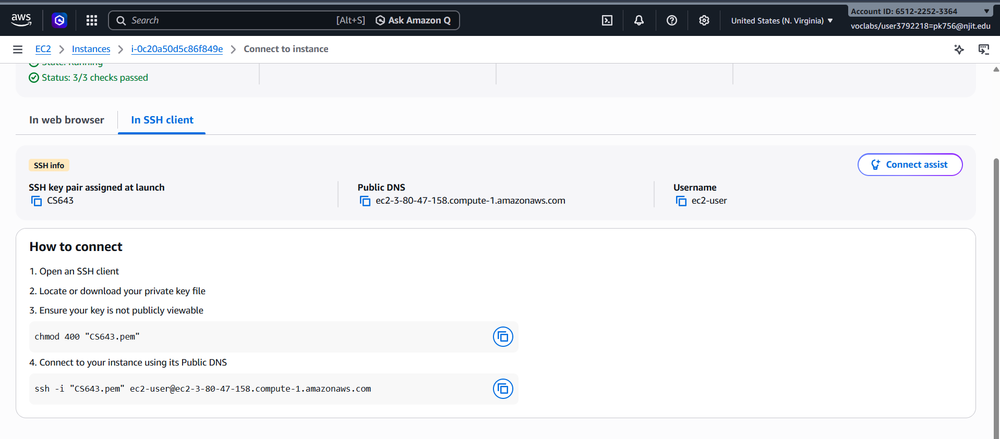
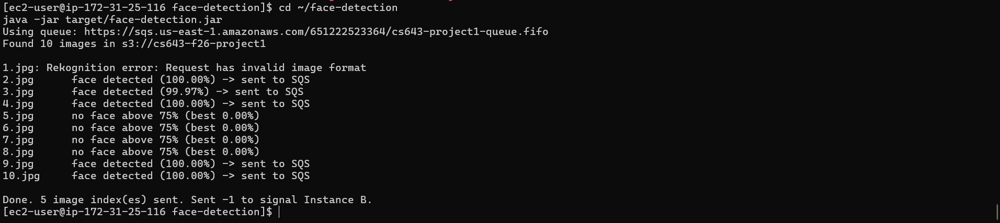
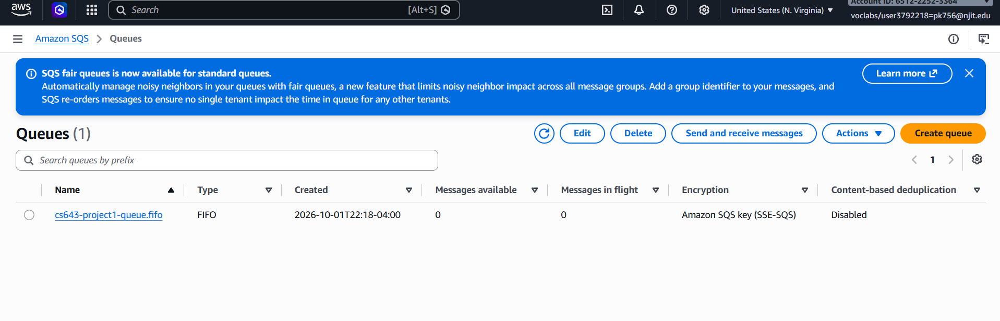
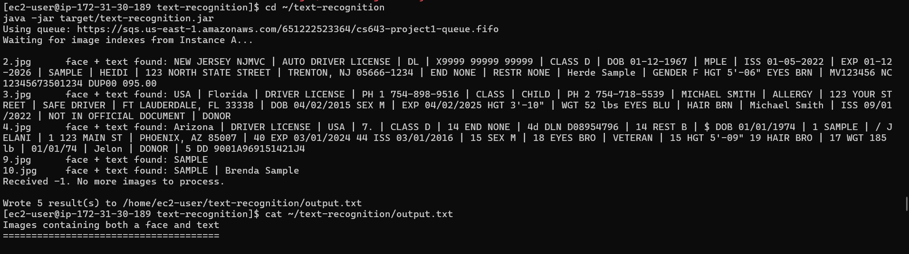
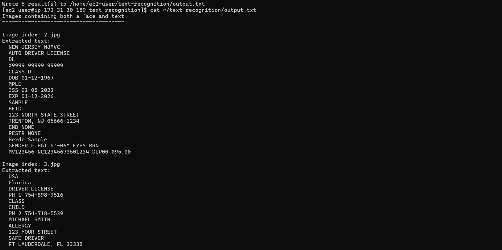

# AWS Image Recognition Pipeline

An image recognition pipeline on AWS that uses two EC2 instances running in parallel, Amazon S3, Amazon SQS, Amazon Rekognition, and Amazon Textract. Both applications are written in Java and run on Amazon Linux.

**Course:** CS 643 Cloud Computing, Project 1 (Fall 2026), New Jersey Institute of Technology
<br>**Author:** Pavan Rahul Konathala<br>
<br>**Demo video:** < https://youtu.be/paf2y7skXe8><br>

## Goal

This individual project is about building a working application from existing AWS services. It covers how to:

1. Create virtual machines in the cloud (EC2 instances).
2. Use cloud storage (S3) from an application.
3. Communicate between virtual machines with a queue service (SQS).
4. Write distributed Java applications that run on Linux VMs in the cloud.
5. Use managed machine learning services (Rekognition for faces, Textract for text).

## Project description

Two EC2 instances, **EC2-A** and **EC2-B**, work on the same 10 images from the public S3 bucket `cs643-f26-project1`.

- **EC2-A (face detection)** runs every image through Rekognition. When an image has a face with confidence above 75%, EC2-A puts that image's index (for example `2.jpg`) on an SQS queue. When it has checked all 10 images, it puts `-1` on the queue.
- **EC2-B (text recognition)** reads indexes from the queue as soon as they arrive, runs each image through Textract, and stops when it reads `-1`. It then writes `output.txt` on its EBS volume, listing only the images that contain both a face and text, along with the text found in each.

The two instances run at the same time: EC2-B can be extracting text from one image while EC2-A is still checking the next. The pipeline works no matter which instance starts first.


### Design decisions

- **FIFO queue (`cs643-project1-queue.fifo`).** A standard SQS queue does not guarantee order, so `-1` could arrive before the last real index. A FIFO queue with one message group keeps messages in the order EC2-A sent them.
- **Either instance can start first.** Both applications call SQS `CreateQueue` with identical settings on startup. The call is idempotent, so whichever runs first creates the queue and the other simply gets its URL.
- **Images read by reference.** Rekognition and Textract read each image directly from S3 by bucket and key, so neither instance downloads image files.
- **Delete after processing.** EC2-B deletes each message only after processing it, so a crash leaves unprocessed indexes in the queue.

## Project structure

```
cs643-project1/
├── README.md
├── .gitignore
├── assets/                         (architecture diagram and screenshots)
├── face-detection/                 (runs on EC2-A)
│   ├── pom.xml
│   └── src/main/java/edu/njit/cs643/FaceDetection.java
└── text-recognition/               (runs on EC2-B)
    ├── pom.xml
    └── src/main/java/edu/njit/cs643/TextRecognition.java
```

## Step-by-step setup and execution

These steps were done from Windows using PowerShell. The key file is at `C:\Users\pavan\CS643\CS643.pem` and the project is at `C:\Users\pavan\CS643\cs643-project1`.

### 1. Start the AWS Learner Lab

1. Log in to AWS Academy and go to **Modules > AWS Academy Learner Lab > Launch AWS Academy Learner Lab**.
2. Click **Start Lab** and wait until the dot next to **AWS** turns green. A red dot means the lab is not running yet.
3. Click **AWS** to open the Management Console, and check that the region in the top right is **US East (N. Virginia) us-east-1**.

### 2. Create a security group

1. Open **EC2 > Security Groups > Create security group** and name it `cs643-project1-sg`.
2. Add three inbound rules, each with the source set to **My IP** so only your computer can reach the instances:
   - SSH (port 22)
   - HTTP (port 80)
   - HTTPS (port 443)
3. Keep the default outbound rule and create the group.


### 3. Launch two EC2 instances

Do this twice, once for **EC2-A** and once for **EC2-B**.

1. Click **Launch instance** and enter the name.
2. **AMI:** Amazon Linux 2023 (64-bit x86).
3. **Instance type:** `t2.micro`.
4. **Key pair:** `CS643` (the built-in `vockey` also works). Use the same key for both instances.
5. **Network settings:** select the existing security group `cs643-project1-sg`.
6. **Storage:** keep the default 8 GiB gp3 volume. This EBS volume is where `output.txt` is saved on EC2-B.
7. **Advanced details > IAM instance profile:** select **LabInstanceProfile**.
8. Click **Launch instance** and note each instance's **Public IPv4 address**.

)

### 4. Check the IAM role

Select each instance and open the **Security** tab. **IAM Role** should show `LabRole`. If it is empty, choose **Actions > Security > Modify IAM role**, select **LabInstanceProfile**, and click **Update IAM role**.

> **Note:** Do not try to add policies to `LabRole` in the IAM console. Learner Lab blocks all IAM changes and returns a `not authorized to perform: iam:AttachRolePolicy` error. `LabRole` already has the S3, SQS, Rekognition, and Textract permissions this project needs.


### 5. Connect with SSH from PowerShell

Windows 10 and 11 include an SSH client, so the `.pem` key works directly in PowerShell.

1. Lock down the key file (one time only). Without this, SSH rejects the key with an "UNPROTECTED PRIVATE KEY FILE" error.
   ```powershell
   icacls "C:\Users\pavan\CS643\CS643.pem" /inheritance:r
   icacls "C:\Users\pavan\CS643\CS643.pem" /grant:r "$($env:USERNAME):(R)"
   ```
2. Connect to each instance in its own PowerShell window, using the public IP without angle brackets:
   ```powershell
   ssh -i "C:\Users\pavan\CS643\CS643.pem" ec2-user@<EC2-A-PUBLIC-IP>
   ssh -i "C:\Users\pavan\CS643\CS643.pem" ec2-user@<EC2-B-PUBLIC-IP>
   ```
3. Type `yes` the first time you connect. The prompt changes to `[ec2-user@ip-... ~]$`.

)

### 6. Install Java 17 and Maven (both instances)

```bash
sudo dnf update -y
sudo dnf install -y java-17-amazon-corretto-devel maven-amazon-corretto17
java -version
mvn -version
```

### 7. Configure AWS credentials (both instances)

1. In Learner Lab, click **AWS Details**, then **Show** next to **AWS CLI**, and copy the whole block. It starts with `[default]` and includes `aws_access_key_id`, `aws_secret_access_key`, and `aws_session_token`.
2. On the instance, open the credentials file in vim:
   ```bash
   mkdir -p ~/.aws
   vim ~/.aws/credentials
   ```
3. Press `i`, right-click in the PowerShell window to paste, press **Esc**, then type `:wq` and press **Enter**. To replace old credentials, type `ggdG` before pressing `i`.
4. Set the region and test access:
   ```bash
   printf "[default]\nregion = us-east-1\n" > ~/.aws/config
   aws sts get-caller-identity
   aws s3 ls s3://cs643-f26-project1
   ```

These credentials expire when the lab session ends, so paste a fresh block each time you start the lab. Plain `aws configure` is not enough because it does not ask for the session token.

)

### 8. Copy the code to the instances

Run these from PowerShell on your laptop, not inside an SSH session:

```powershell
scp -i "C:\Users\pavan\CS643\CS643.pem" -r "C:\Users\pavan\CS643\cs643-project1\face-detection" ec2-user@<EC2-A-PUBLIC-IP>:~/
scp -i "C:\Users\pavan\CS643\CS643.pem" -r "C:\Users\pavan\CS643\cs643-project1\text-recognition" ec2-user@<EC2-B-PUBLIC-IP>:~/
```

### 9. Build the applications

On EC2-A:

```bash
cd ~/face-detection
mvn clean package
```

On EC2-B:

```bash
cd ~/text-recognition
mvn clean package
```

Each build produces a single runnable JAR in `target/`. The first build downloads dependencies and can take a few minutes on a micro instance.


### 10. Run the pipeline

Start both applications at roughly the same time. The order does not matter, and the demo shows both orders.

#### Running on EC2-A (face detection)

```bash
java -jar target/face-detection.jar
```

EC2-A prints each image with its highest face confidence and whether its index was sent to SQS. After the last image it sends `-1`.

![EC2-A console output]

The queue is created automatically by whichever application starts first:

![SQS FIFO queue in the console]

#### Running on EC2-B (text recognition)

```bash
java -jar target/text-recognition.jar
```

EC2-B waits for indexes, prints the text found in each image, and exits when it receives `-1`.

![EC2-B console output]

### 11. View the output

On EC2-B:

```bash
cat ~/text-recognition/output.txt
```

`output.txt` lists only the images that contain both a face and text, each with its extracted text.

![Final output.txt]

### 12. Clean up

1. Optionally delete the queue in the SQS console.
2. **Terminate both EC2 instances** (EC2 > Instances > select both > Instance state > Terminate).
3. Click **End Lab** in Learner Lab.

## Troubleshooting

| Problem | Fix |
|---|---|
| `not authorized to perform: iam:AttachRolePolicy` | Expected in Learner Lab. Do not edit `LabRole`; attach `LabInstanceProfile` to the instance instead (step 4). |
| `Unable to locate credentials` | Run the command inside the EC2 instance, not on your laptop. Then check the IAM role (step 4) or paste the credentials (step 7). |
| `Identity file ... not accessible` | The `.pem` path is wrong. Check where the key is with `ls`, and keep it outside the project folder. |
| `Could not resolve hostname <...>` | Remove the angle brackets around the IP address. |
| `UNPROTECTED PRIVATE KEY FILE` | Run the two `icacls` commands in step 5. |
| `Permission denied (publickey)` | Use `ec2-user` as the username and the key pair the instance was launched with. |
| SSH connection timed out | Your IP probably changed. Set the security group source to **My IP** again. |
| Leftover messages from a crashed run | SQS console > select the queue > **Purge**, then run again. |
| Build runs out of memory on t2.micro | Run `export MAVEN_OPTS="-Xmx512m"` before `mvn clean package`. |

## Use of AI tools and references


I used Claude (Anthropic) throughout this project. I uploaded the assignment PDF and asked for a step-by-step plan and the Java code for both applications. Claude produced the two Java programs, the Maven `pom.xml` files, and drafts of this README and the project report. It also pointed out design issues, such as using a FIFO queue so `-1` cannot arrive before the last index, and creating the queue from both applications so either instance can start first.


I reviewed the code to understand each AWS call, set up the AWS environment, built and ran the applications on the EC2 instances, and recorded the demo myself.

